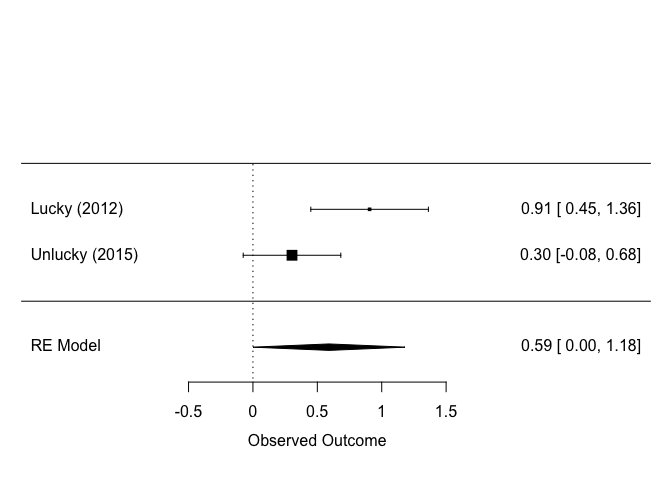
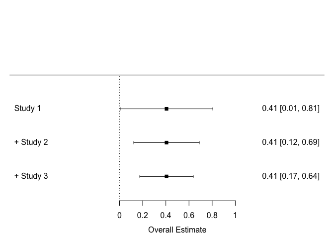
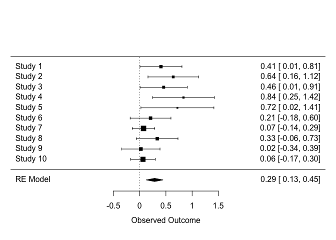
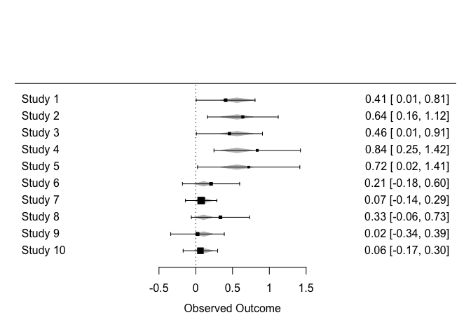
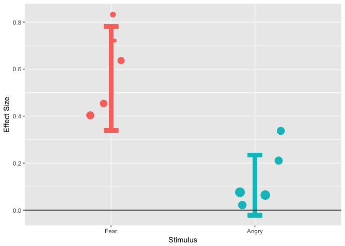

# Meta-analysis in R.


Meta-analysis is a technique that allows us to quantitatively combine research knowledge, improve the precision of our parameter estimates and discover insights that would not be revealed from considering individual studies in isolation.

People can often balk at the mention of the words "meta-analysis". The words conjure up images of large groups of expert statisticians working long hours on intimidatingly large datasets.

In reality, these are significant and harmful misconceptions. Recently, R and in particular, the 'metafor' package has made conducting meta-analysis incredibly straightforward. Moreover, the idea that meta-analyis is a tool that should be restricted to use on large scale datasets is incorrect. Even combining the results of just 2 studies can be extremely valuable.

## Meta-analysis - 3 examples.

The power of meta analysis is best illustrated with some examples.


### Example 1: Lucky and Unlucky


Lets suppose that we have two studies that are replications of one another. The first study, published by Lucky et al (2012) in Current Biology revealed a large, significant effect (N = 26, p=.0001). The second study, published by Unlucky et al (2015) in a low-impact journal failed to detect a statistically significant effect (N= 28, p=.12). Since Unlucky failed to replicate Luckys finding with a larger sample, they questioned the existence of the effect. 

These results appear to be somewhat in conflict with one another. The first study robustly indicated that we should reject the null hypothesis, whereas the latest evidence suggests that we should retain the null. Intuitively, we know that we should have more faith in the outcome of the study with the larger sample, so maybe Unlucky's conclusion should be the one that we take to the bank.

What happens if we perform a meta-analysis on the data?

The code below will define some utility functions, perform a meta-analysis on the two studies, report some information about our meta-analytic model and produce a forest plot. We don't need to understand what all this means just yet, since we will be repeating these steps in more detail in later sections. 


```r
# Import metafor library
library(metafor)
```

```
## Loading required package: Matrix
```

```
## Loading 'metafor' package (version 2.0-0). For an overview 
## and introduction to the package please type: help(metafor).
```

```r
# Define a function for converting from p value and N to Cohen's d and 95% CI's
ptoDr=function(p,N,r)
{T=qt(p/2,N-1)
D=T/sqrt(N)
Da=D*sqrt(2*(1-r))
Da2=sqrt(Da^2)
SE=sqrt(1/N+D^2/(2*N))*sqrt(2*(1-r))
CIp=Da2+(SE*1.96)
CIn=Da2-(SE*1.96)
DSE=c(Da2,SE,CIn,CIp)}

# Define a function for outputing information from rma object
tidy=function(obj)
{sprintf(c("The pooled effect size is %f","The lower limit of the 95 percent confidence interval is %f","The upper limit of the 95 percent confidence interval is %f","The pooled p value is %f"),c(obj$beta,obj$ci.lb,obj$ci.ub,obj$pval))}
  
  
# Convert the p and N values from the Lucky and Unlucky studies to Cohens d and 95% CIs
Lucky=ptoDr(.0001,26,0.5)
Unlucky=ptoDr(.12,28,0.5)

# Add both studies to a dataframe.
DATA=data.frame(rbind(Lucky,Unlucky))
colnames(DATA)=c("D","SE")

# Estimate random effects model and report some model results
META=rma(yi=D,sei=SE,data=DATA)
tidy(META)
```

```
## [1] "The pooled effect size is 0.590644"                               
## [2] "The lower limit of the 95 percent confidence interval is 0.000882"
## [3] "The upper limit of the 95 percent confidence interval is 1.180405"
## [4] "The pooled p value is 0.049658"
```


```r
# Forest plot of the data.
forest(META,slab=c("Lucky (2012)","Unlucky (2015)"))
```

<!-- -->


The above plot is referred to as a *forest plot*. It depicts the effects sizes and confidence intervals for the studies that contribute to our meta-analysis. Below the two contributing studies, the meta analytic combination of the effects is depicted by a diamond.

Here, we see that Lucky and Unlucky rejected and retained the null hypothesis respectively. However both effects are in the same direction and the confidence intervals overlap. Importantly, the model output has told us that the meta-analytic combination of effects has detected a significant effect. Perhaps there was not much of a conflict after all.

This illustrates one of the main advantages of meta-analysis - if we had considered the results of the individual studies alone, we would be left with a seemingly incoherent picture. Meta-analysis allows us to "*see the wood for the trees*". The findings only appear inconsistent to the extent that they are treated as individual entities. This isn't really how science should work. We should apply techniques to quantitatively combine research findings. This is the job of meta analysis. 


### Example 2: A miraculous replication


In 2001, a group of researchers found that a new treatment was effective at reducing depression (N=26, p=.049). 

Unfortunately the authors only had access to a small sample and so the confidence interval around their effect size estimate was very large.

In 2008 they managed to perform a replication study with an independent sample of participants . Miraculously, they found that the effect was identical in magnitude! (N=26, p=.049). In 2011, they replicated the study and again found exactly the same effect! (N=26, p=.049).

The code below will fit a meta-analytic model to these studies and plot a slightly adapted version of a forest plot, which will be described below.


```r
Study2001=ptoDr(.049,26,0.5)
Study2008=ptoDr(.049,26,0.5)
Study2011=ptoDr(.049,26,0.5)


DATA2=data.frame(rbind(Study2001,Study2008,Study2011))
colnames(DATA2)=c("D","SE")

META2=rma(yi=D,sei=SE,data=DATA2)

tidy(META2)
```

```
## [1] "The pooled effect size is 0.405830"                               
## [2] "The lower limit of the 95 percent confidence interval is 0.174951"
## [3] "The upper limit of the 95 percent confidence interval is 0.636709"
## [4] "The pooled p value is 0.000571"
```


```r
# Forest plot of the data.
par(mar=c(4,4,1,2))
forest(cumul(META2))
```

<!-- -->

The above plot is another forest plot, but this time it shows the effect of fitting a meta-analytic model after each successive study is published (otherwise known as a cumulative meta analysis). 

We see that from study 1 to study 3, our combined confidence interval width has reduced from 0.8 to 0.47. This is an incredibly valuable increase in precision. Moreover, the pooled p value has reduced substantially from 0.49 to .0006. 

The take home message here is that meta analysis greatly improves the precision of our parameter estimates. The example also illustrates that several studies indicating weak evidence for an effect, when combined, can indicate very strong evidence of an effect.


### Example 3: Apples and Oranges

Lets suppose that we are performing a meta analysis on 10 studies that investigate the effect of threatening stimuli on visual search performance. In these studies, a positive value of the effect size indicates that threatening stimuli are detected more rapidly than neutral stimuli.


```r
Study1=ptoDr(.049,26,0.5)
Study2=ptoDr(.01,20,0.5)
Study3=ptoDr(.049,21,0.5)
Study4=ptoDr(.006,15,0.5)
Study5=ptoDr(.049,10,0.5)
Study6=ptoDr(.3,26,0.5)
Study7=ptoDr(.5,85,0.5)
Study8=ptoDr(.10,26,0.5)
Study9=ptoDr(.9,29,0.5)
Study10=ptoDr(.6,70,0.5)

DATA3=data.frame(rbind(Study1,Study2,Study3,Study4,Study5,Study6,Study7,Study8,Study9,Study10))

colnames(DATA3)=c("D","SE")

META3=rma(yi=D,sei=SE,data=DATA3)

forest(META3)
```

<!-- -->

```r
tidy(META3)
```

```
## [1] "The pooled effect size is 0.285605"                               
## [2] "The lower limit of the 95 percent confidence interval is 0.125040"
## [3] "The upper limit of the 95 percent confidence interval is 0.446170"
## [4] "The pooled p value is 0.000490"
```


The outcome of the meta analysis indicates a modest and significant overall effect. Just by eyeballing the figure though, we can see that there is substantial heterogeneity between the contributing effect sizes. Some studies seem to indicate fairly large effects, others fairly small effects. 

Later, after inspecting the papers more closely, we realise that studies 1-5 used fearful faces as threat stimuli and studies 6-10 used angry faces. In order to determine whether the choice of stimulus explains this heterogeneity, we perform a *moderator analysis* 


```r
# Code studies 1 to 5 as using fearful faces and the rest as angry.
DATA3$Stimulus=c(rep(1,5),rep(2,5))
DATA3$Stimulus=factor(DATA3$Stimulus, levels=c(1,2),labels=c("Fear","Angry"))

# Fit the model, specifying stimulus type as a moderator.
META3_MOD=rma(yi=D,sei=SE,data=DATA3,mods=~Stimulus)

# Show a forest plot
forest(META3_MOD)
```

<!-- -->

In the above forest plot we see our data, with an underlayed grey diamond. The grey diamond under the first 5 effects indicates the overall effect of fearful faces. The grey diamond under the effects 6-10 indicates the overall effect of angry faces. This plot seems pretty ugly to me, so lets make our own, prettier plot using ggplot2.


```r
# Define ggplot function for plotting a main effect from a rma object
library(ggplot2)
PLOTMAIN=function(MODEL){
  pred=predict(MODEL)
  MODERATOR=as.character(MODEL$call$mods[2])
  FRAME=cbind(get(as.character(MODEL$call$data)),pred$pred,pred$ci.lb,pred$ci.ub)
  #Scale the studies sych that larger studies (smaller SE) are represented larger on the plot.
  FRAME$pointsize=10-((10-1)/(max(FRAME$SE)-min(FRAME$SE))*(FRAME$SE-max(FRAME$SE))+10)+1
  PLOT=ggplot(FRAME, aes(x=get(MODERATOR),y=D))+geom_point(aes(colour=get(MODERATOR),size=pointsize),position = position_jitter(w = 0.2))+
  geom_errorbar(aes(ymin=FRAME[max(col(FRAME))-2],ymax=FRAME[max(col(FRAME))-1],x=get(MODERATOR),colour=get(MODERATOR)),width=0.1,size=3)+
  scale_colour_discrete(guide='none')+scale_size_area(guide='none')+ylab("Effect Size")+xlab(MODERATOR)+geom_hline(yintercept=0)
  return(PLOT)}

# Apply to model object.
PLOTMAIN(META3_MOD)
```

<!-- -->

Here we have a slightly different implementation of the plot. On the X axis we have our 2 moderator levels and on the Y axis we have the effect size (Cohen's d). The points represent the studies contributing to the meta analysis, where studies with a larger N appear larger on the plot. The confidence intervals show the meta-analytic estimate for each level of our moderator. We can clearly see that substantially different pooled effect sizes are estimated for fear and angry faces, but is the 'Stimulus' moderator significant? To answer this question, let's inspect the model object.


```r
# Print model summary

META3_MOD
```

```
## 
## Mixed-Effects Model (k = 10; tau^2 estimator: REML)
## 
## tau^2 (estimated amount of residual heterogeneity):     0 (SE = 0.0140)
## tau (square root of estimated tau^2 value):             0
## I^2 (residual heterogeneity / unaccounted variability): 0.00%
## H^2 (unaccounted variability / sampling variability):   1.00
## R^2 (amount of heterogeneity accounted for):            100.00%
## 
## Test for Residual Heterogeneity: 
## QE(df = 8) = 3.8891, p-val = 0.8670
## 
## Test of Moderators (coefficient(s) 2): 
## QM(df = 1) = 12.1153, p-val = 0.0005
## 
## Model Results:
## 
##                estimate      se     zval    pval    ci.lb    ci.ub     
## intrcpt          0.5599  0.1127   4.9673  <.0001   0.3390   0.7809  ***
## StimulusAngry   -0.4536  0.1303  -3.4807  0.0005  -0.7091  -0.1982  ***
## 
## ---
## Signif. codes:  0 '***' 0.001 '**' 0.01 '*' 0.05 '.' 0.1 ' ' 1
```


The 'test of moderators' has detected a significant effect of Stimulus (Q(1)=12.1153, p =.0005). Our fitted parameters indicate that Angry faces yield effect sizes that are -0.45 less than fearful faces (the intercept). However, in order to determine whether angry faces themselves yield a detectable effect, we need a different parameterization of the model.


```r
META3_MOD2=rma(yi=D,sei=SE,data=DATA3,mods=~Stimulus-1)

# Print model summary
META3_MOD2
```

```
## 
## Mixed-Effects Model (k = 10; tau^2 estimator: REML)
## 
## tau^2 (estimated amount of residual heterogeneity):     0 (SE = 0.0140)
## tau (square root of estimated tau^2 value):             0
## I^2 (residual heterogeneity / unaccounted variability): 0.00%
## H^2 (unaccounted variability / sampling variability):   1.00
## 
## Test for Residual Heterogeneity: 
## QE(df = 8) = 3.8891, p-val = 0.8670
## 
## Test of Moderators (coefficient(s) 1:2): 
## QM(df = 2) = 27.3150, p-val < .0001
## 
## Model Results:
## 
##                estimate      se    zval    pval    ci.lb   ci.ub     
## StimulusFear     0.5599  0.1127  4.9673  <.0001   0.3390  0.7809  ***
## StimulusAngry    0.1063  0.0654  1.6249  0.1042  -0.0219  0.2345     
## 
## ---
## Signif. codes:  0 '***' 0.001 '**' 0.01 '*' 0.05 '.' 0.1 ' ' 1
```


Here we see that a robust effect has been detected for fear faces (d = 0.56, p<.0001), whereas angry faces do not yield detectable effects (d = 0.11, p=.104). In some ways, it seems as though we were initially combining 'apples and oranges' into the same analysis.

This example illustrates another important application of meta analysis - here we have answered a novel research question that was never addressed by any of these individual studies. Specifically, all studies employed only 1 stimulus type and so did not address the question of whether fear faces yielded larger effects than angry faces. However, we have been able to answer this question with a secondary analyis of existing data.

We can extend this process of moderator analysis to define arbitrarily complex models, including multiple factors and their interactions, so we can optimally explain the differences in effect size estimates emanating from a set of studies. 


