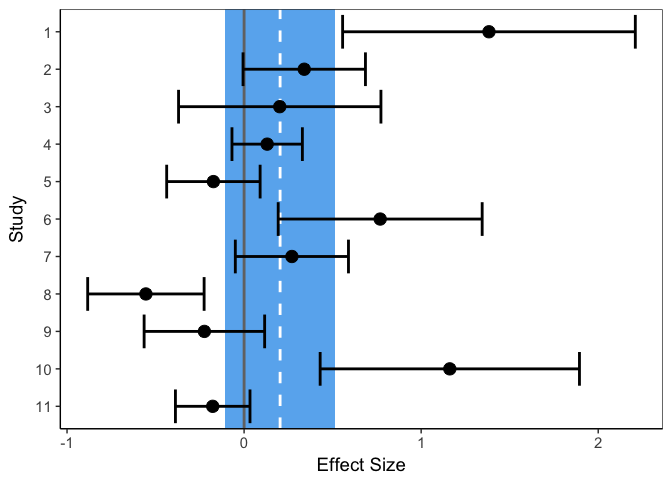

## Creating and interacting with model objects.


This chapter will provide details on how to fit and interact with model objects using R. The metafor package ensures that this is extremely user friendly and straightforward. We will also talk a little about interpretation. 

***

## Data format


At a minimum, metafor requires a dataframe that specifies the effect sizes and some measure of their variance.

First, we define a function for computing our effect sizes.


```r
ptoD=function(p,N)
{T=qt(p/2,N-1)
D=T/sqrt(N)
Da=D*sqrt(2*(1-0.5))
Da2=sqrt(Da^2)
SE=sqrt(1/N+D^2/(2*N))*sqrt(2*(1-0.5))
CIp=Da2+(SE*1.96)
CIn=Da2-(SE*1.96)
DSE=c(Da2,SE,CIn,CIp)}
```


We next read in a .csv file which contains the data we have collected from our contributing papers. This is an idealised case where we have the same information reported for each paper (the p value and N).


```r
DATAFILE=read.csv("CH_03_data.csv")
head(DATAFILE)
```

```
##     Study Date  pval  N Dir
## 1     Tom 1999 0.001 11   1
## 2    Dick 2000 0.056 34   1
## 3   Harry 2001 0.500 12   1
## 4  Dasher 2002 0.200 98   1
## 5  Dancer 2003 0.200 56   2
## 6 Prancer 2004 0.010 15   1
```


Here we loop through the dataframe, compute Cohen's d and the SE of d and throw them into new columns of our dataframe. 


```r
DATAFILE$d=rep(0,nrow(DATAFILE))
DATAFILE$SE=rep(0,nrow(DATAFILE))

for (i in 1:nrow(DATAFILE)){
  temp=ptoD(DATAFILE$pval[i],DATAFILE$N[i])
 DATAFILE$d[i]=temp[1]
 DATAFILE$SE[i]=temp[2]
 if (DATAFILE$Dir[i]==2){
   DATAFILE$d[i]=-DATAFILE$d[i]
 }
}
head(DATAFILE)  
```

```
##     Study Date  pval  N Dir          d        SE
## 1     Tom 1999 0.001 11   1  1.3830005 0.4217221
## 2    Dick 2000 0.056 34   1  0.3397029 0.1763769
## 3   Harry 2001 0.500 12   1  0.2013351 0.2915859
## 4  Dasher 2002 0.200 98   1  0.1303440 0.1014434
## 5  Dancer 2003 0.200 56   2 -0.1733369 0.1346306
## 6 Prancer 2004 0.010 15   1  0.7686175 0.2938692
```


Now we have everything we need to fit a simple model to the data.


```r
library(metafor)
```

```
## Loading required package: Matrix
```

```
## Loading 'metafor' package (version 2.0-0). For an overview 
## and introduction to the package please type: help(metafor).
```

```r
model=rma(data=DATAFILE,yi=d,sei=SE)
```


Before we look at the output, lets talk about the inputs.


1. *data* is the name of the dataframe containing the effect sizes and their variance.
2. *yi* is the name of the column specifying the location of the effect sizes. Note that there is no requirement to specify the type of effect size metic.
3. *sei* is the name of the column specifying the location of the standard errors for d. Note that we could just as easily use *'vi='* if we calculated the variances instead of standard errors.

This is all very straightforward, and in most cases this all we need to specify to fit our model (unless we want to look at moderators - more on that in later chapters).


***


## Fixed and random effects models.


With meta analysis, we generally want to come up with some overall effect size estimate based on the contributing effect sizes. This is conceptually similar to just a big weighted regression. We are just estimating a parameter (a beta weight) that minimises the residuals between our regrssion line and the empirical data. Obviously though, it doesn't make sense for all studies to be weighted in the same way - a study with 10 participants shouldnt contribute to the estimate as much as a study with 100 participants. Therefore, we use an *inverse weighting* scheme, wherein studies with a larger variance/standard error are given less weight in our calculation.

This is all quite straightforward. However, there are two types of model that we can employ for meta analyses - fixed effects and random effects models. These models differ with respect to how they assign weights to individual studies.

A thorough discussion regarding fixed and random effects models is given [here](https://www.meta-analysis.com/downloads/Meta-analysis%20fixed%20effect%20vs%20random%20effects_orig.pdf).

In brief, the main differences are:

1. The fixed effects model assumes that all studies contributing to the meta analysis are direct replications of one another. As a result, it assumes that there is *one true effect size* to be estimated.
2. The random effects model allows for the assumption that the true effect may vary from study to study. The studies therefore capture something from the *relevant distribution of effects* and our combined estimate is the mean of this distribution.

The main consequence of all this is that the inverse weighting scheme is more relaxed in the random effects model. We don't want to trivialise the influence of small studies as much since they may be measuring something unique in the relevant distribution of effect sizes.

A lot of fuss is sometimes made of whether you should use a fixed or random effects model. This type of discussion is mostly pointless, because as a general rule of thumb, you should *always use a random effects model*. The reason for this is that random effects models are in general more conservative and if it's assumptions are not met (i.e. studies are indeed direct replications of one another) then it produces the same output as the fixed effects model anyway. In any event, the fixed effects model has some unrealistic assumptions that do not apply to the majority of experimental psychology literature. Even if studies attempt to replicate each other (which is rare), there are still likely to be important differences in demographic variables, the precision of the method and other details that mean slightly different effects are being estimated. For this reason, random effects models are a better reflection of the reality we are operating in.

All this is a long way of explaining that the *rma* command we specififed earlier is indicating that we want to use a random effects model. If we wanted to use a fixed effects model instead for some reason, then we can use *rma(yi=, sei=, method="FE")*.


***

## The rma object

Now lets have a look at the rma object we created earlier. As per most model objects in R, we can print a digestible summary of the important outputs via the summary() command.


```r
summary(model)
```

```
## 
## Random-Effects Model (k = 11; tau^2 estimator: REML)
## 
##   logLik  deviance       AIC       BIC      AICc  
##  -8.4620   16.9239   20.9239   21.5291   22.6382  
## 
## tau^2 (estimated amount of total heterogeneity): 0.2224 (SE = 0.1206)
## tau (square root of estimated tau^2 value):      0.4716
## I^2 (total heterogeneity / total variability):   88.70%
## H^2 (total variability / sampling variability):  8.85
## 
## Test for Heterogeneity: 
## Q(df = 10) = 52.6242, p-val < .0001
## 
## Model Results:
## 
## estimate      se    zval    pval    ci.lb   ci.ub   
##   0.2034  0.1573  1.2924  0.1962  -0.1050  0.5117   
## 
## ---
## Signif. codes:  0 '***' 0.001 '**' 0.01 '*' 0.05 '.' 0.1 ' ' 1
```


Here I will describe some of the important meta analysis terminology in the output. Lets start from the top line of this output.

*k* is the number of studies included in the meta-analysis.
On the following line, we have a bunch of standard model fit indices, akin to those usually reported in general linear models (AIC etc).

On the following few lines, we have several measures of heterogeneity, which are helpfully labeled for us. The important ones are:

*tau^2* is a measure of variance between studies. 

*I^2* describes the proportion of heterogeneity beyond that explained by sampling variability. It is essentially an expression of the inconsistency between studies. If there is little inconsistency in study results then I^2 will tend towards 0. If I^2 is 0 then the fixed and random effects models will have identical estimates of the pooled effect size. 

*Q* is the total amount of heterogeneity between studies. Q is distributed as a chi-square statistic with k-1 degrees of freedom. If Q is notably greater than the degrees of freedom, then this suggests that the heterogeneity between studies is greater than that expected from sampling variability alone. On some level, it can be seen of as an evaluation of whether the assumptions of a fixed effects model were violated.

The remaining output under the "Model Results" section should be straightforward to interpret. The *estimate* is the pooled meta-analytic estimate of the effect size. The *se* is its standard error and the *pval* evaluates the null hypothesis based on the meta-analytic combination of effects. *ci.lb* and *ci.ub* are the lower and upper bounds of the 95% confidence interval respectively.

***

## Reporting the meta analytic model.


In the example above, this would all be would be reported as follows:


**Method section**
*"We made an a priori decision to analyze our effect size data in a random effects model, due to its tolerance of heterogeneous effect sizes and conservative nature of estimation (Cumming, 2012). The random effects model assumes that each study estimates different values from a distribution of population parameters, rather than assuming that studies are direct replications of each other (Schmidt, Oh, & Hayes, 2009). We assessed heterogeneity across effect sizes by using Cochran’s Q and I^2 statistics."*

**Results section**
*"A random effects model revealed that the pooled effect size was small and did not reach significance  (k = 11, N = 440, dz = 0.20, 95% CI [-0.11 0.51], p = .196)."*

*"Substantial heterogeneity was detected (Q(10) =52.62, p<.001) and the I^2 statistic indicated that 88% of the heterogeneity could not be accounted for by sampling variability"*


***

## Useful visualisations for meta analysis models. 


### Forest plots.


The forest plot is the most common, intuitive way of ploting the results of a meta analysis. Here I define a function for creating a forest plot from a rma model object. We plot the individual effect sizes and their 95% confidence intervals. We also plot a shaded region that demarcates the combined effect size as estimated by the random effects model. We could just as easily do something very similar using the metafor function 'forest()', but the graphics are not as nice.


```r
library(ggplot2)
plotforest=function(model){
  
  frame=get(as.character(model$call$data))
  frame$yi=get(as.character(model$call$yi),frame)
  frame$sei=get(as.character(model$call$sei),frame)
  frame$n=c(1:nrow(frame))
  frame$n=factor(frame$n)
  frame$upr=frame$yi+(1.96*frame$sei)
  frame$lwr=frame$yi-(1.96*frame$sei)
  frame$d=as.numeric(model$b)
  lwr=as.numeric(model$ci.lb)
  upr=as.numeric(model$ci.ub)
  forest=ggplot(frame, aes(n,yi))+geom_rect(xmax=-1,xmin=length(frame$n)+1,ymin=lwr,ymax=upr,fill="steelblue2",alpha=.2)+ geom_hline(aes(yintercept=d),linetype="dashed",colour="white",size=1) +scale_x_discrete(limits = rev(levels(frame$n))) + geom_hline(aes(yintercept=0),linetype="solid",size=1,colour="gray45")+geom_point(size=4)+geom_errorbar(aes(ymin=lwr, ymax=upr),size=1)+coord_flip()+ylab("Effect Size")+xlab("Study")+theme_bw(base_size = 14)+
  theme(panel.grid.minor = element_blank(),panel.grid.major = element_blank(),panel.background = element_blank(), axis.line = element_line(colour = "black"))
  return(forest)
  
}

plotforest(model)
```

<!-- -->


Because we have plotted 95% confidence intervals, we know that if they pass through zero (grey vertical line) the effect was non-significant. We also see that because our blue region also overlaps with zero our pooled estimate is also non-significant.

### Funnel plots.

Next I define a function for creating a funnel plot from a rma model object. A funnel plot is typically designed to check for the existence of publication bias. 


```r
plotfunnel=function(model){
  frame=get(as.character(model$call$data))
   frame$yi=get(as.character(model$call$yi),frame)
  frame$sei=get(as.character(model$call$sei),frame)
  pvals=c(0.05,0.01,0.001,0.0001,0.00001,0.000001,0.0000001)
  norms=c(qnorm(pvals),-qnorm(pvals))
  J=rep(c("red","yellow","blue","green","orange","purple","black"),2)
  d=model$b
  funnel=ggplot(frame, aes(sei,yi))+scale_y_continuous(limits=c(-max(frame$yi),max(frame$yi)))+geom_hline(yintercept=d,linetype="dotted",size=2)+coord_flip()+ geom_abline(slope=norms,size=1,colour=J,alpha=.4)+geom_point(size=6,colour="black",shape=2)+ylab("Effect Size")+xlab("SE")+theme_bw(base_size = 14)+
  theme(panel.grid.minor = element_blank(),panel.grid.major = element_blank(),panel.background = element_blank(), axis.line = element_line(colour = "black")) + geom_hline(aes(yintercept=0),linetype="solid",size=1,colour="gray45")
return(funnel)
  
}

plotfunnel(model)
```

<!-- -->


The logic of a funnel plot is that there is evidence for publication bias if the distribution of effect sizes is asymetrical about the pooled effect size (dotted line in this plot). Publication bias can be infered if there is asymetry where the standard error is large. This suggests that studies with low power are more likely to be published if they report large effect sizes (associated with significant effects). 

We have also enhanced this plot with contours that depict p values (red = .05, yellow =.01, blue =.001 and so on). We should probably be a little supsicious if there a bunch of datapoints located just to the right of the red line - this would suggest an unusual distribution of p values that are all only just 'significant'. This would be indicative of p-hacking.

I suppose that I'm quite skeptical about how useful these inferences are about publication bias. Exactly what 'symmetry' means in this context is never really formally defined and so is open to interpretation. Moreover, the proportion of significant studies isnt a particularly useful metric without an expected percentage of significant studies. 


***

## Summary

In this chapter, we started to create and interact with model objects in R. We learned something about:

1. How to input data to a metafor model object.
2. How to interpret the model output. 
3. How to report the model output.
4. How to create some useful visualisations of the model.

In the next chapter, we will begin to focus on how we can assess the robustness of our models.  


